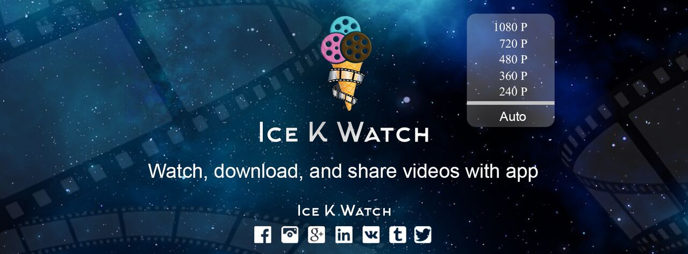
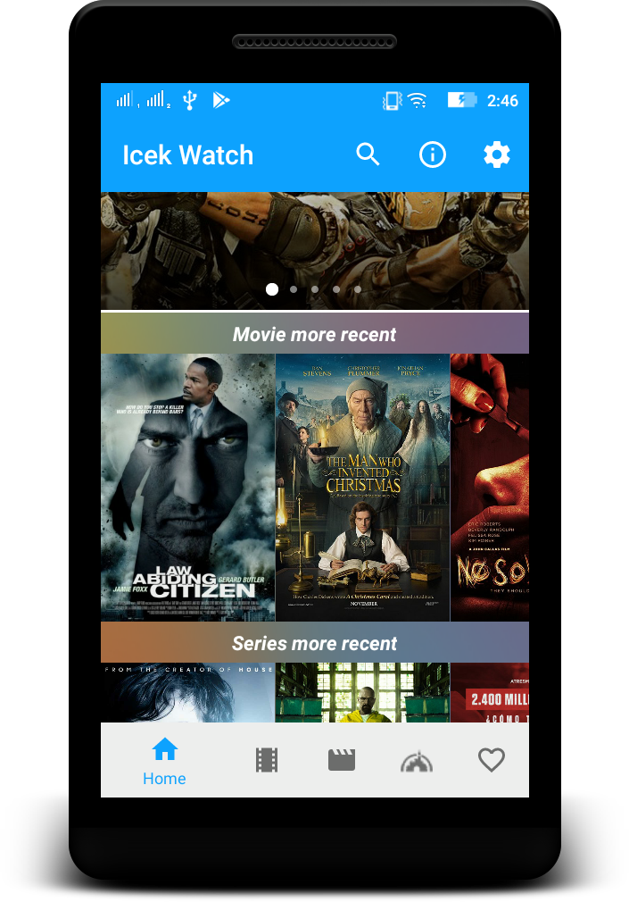
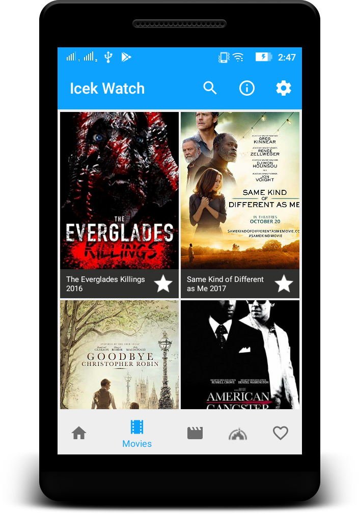
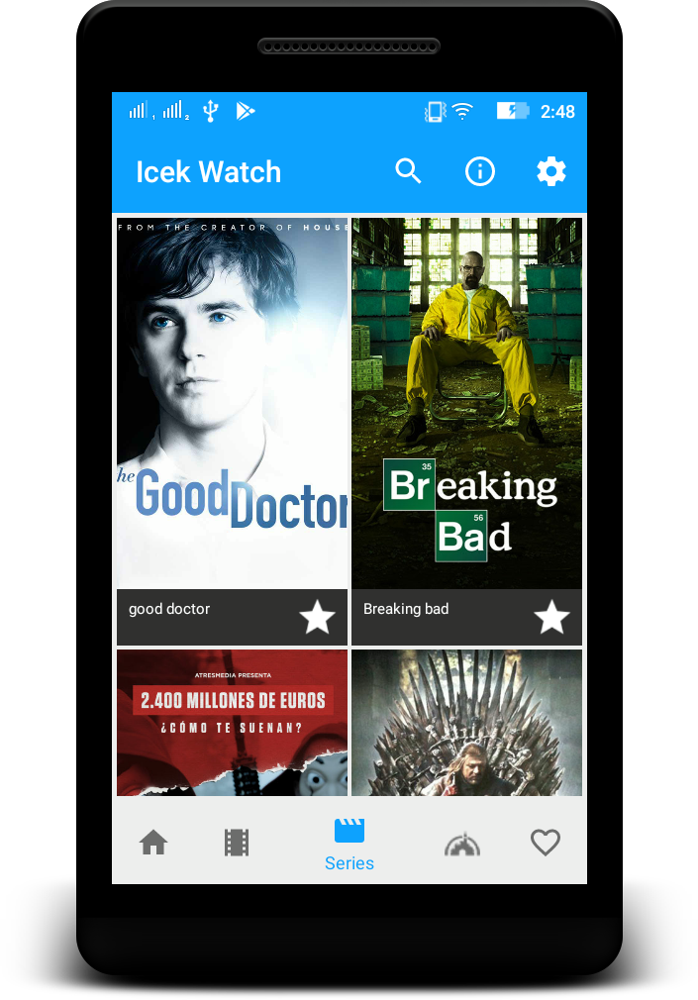
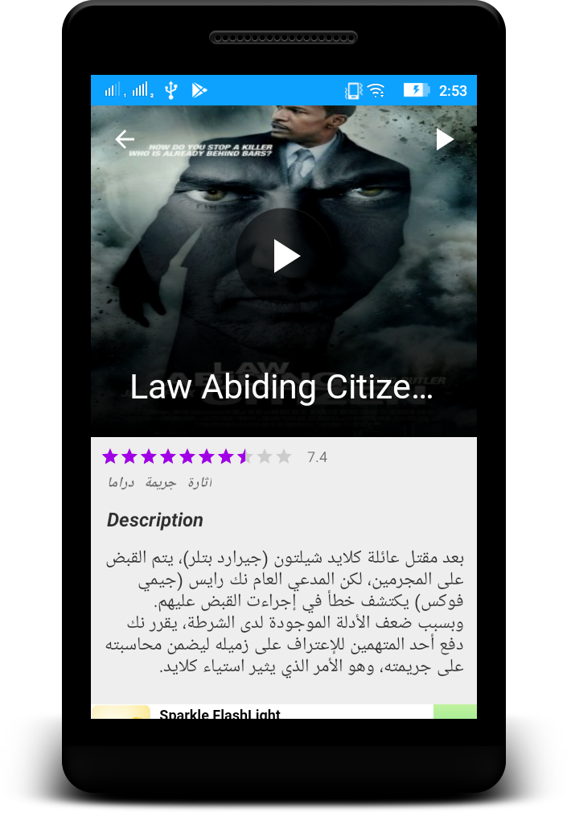
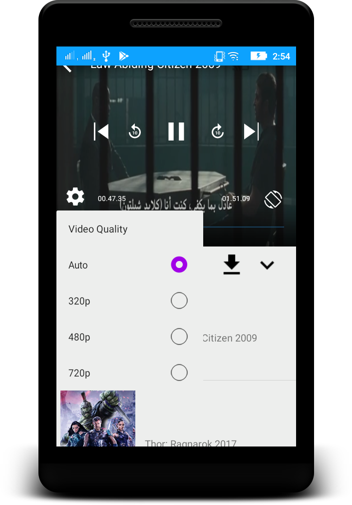
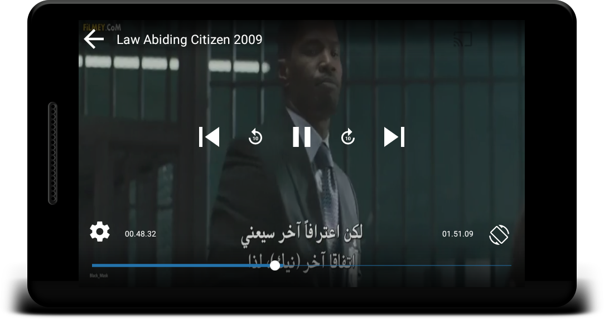

# IcekWatch

# ScreenShot

# Developer
[Seif Hadjhassen - Github](https://github.com/seifhjh)\
[Seif Hadjhassen - Linked In](https://www.linkedin.com/in/seifhadjhassen)\
[Seif Hadjhassen - Facebook](https://www.facebook.com/seif.hajhassen)\
[Seif Hadjhassen - Twitter](https://twitter.com/seifhadjhassen)\
[Seif Hadjhassen - Dribbble](https://dribbble.com/seifhadjhassen)\
[Seif Hadjhassen - Pinterest](https://www.pinterest.com/seifhadjhassen)
